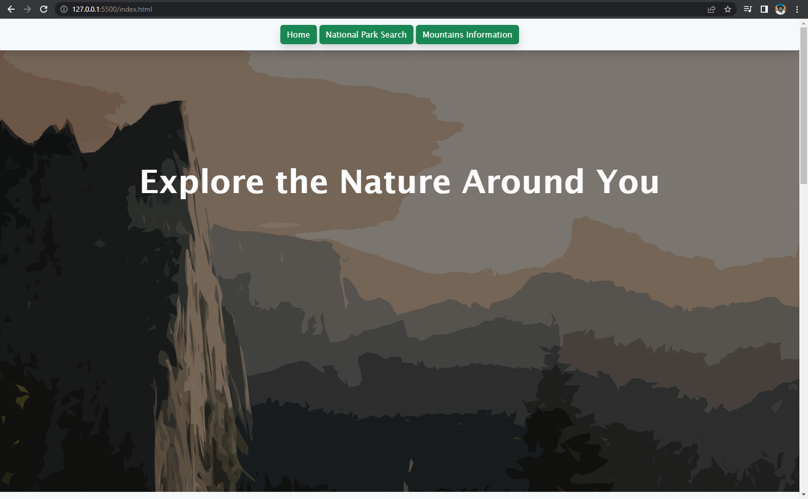
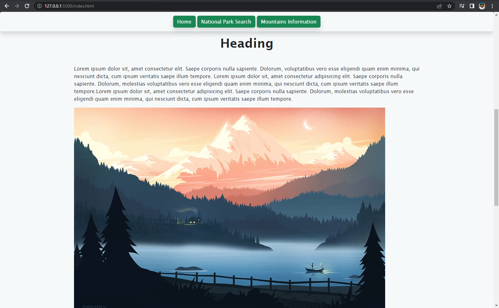
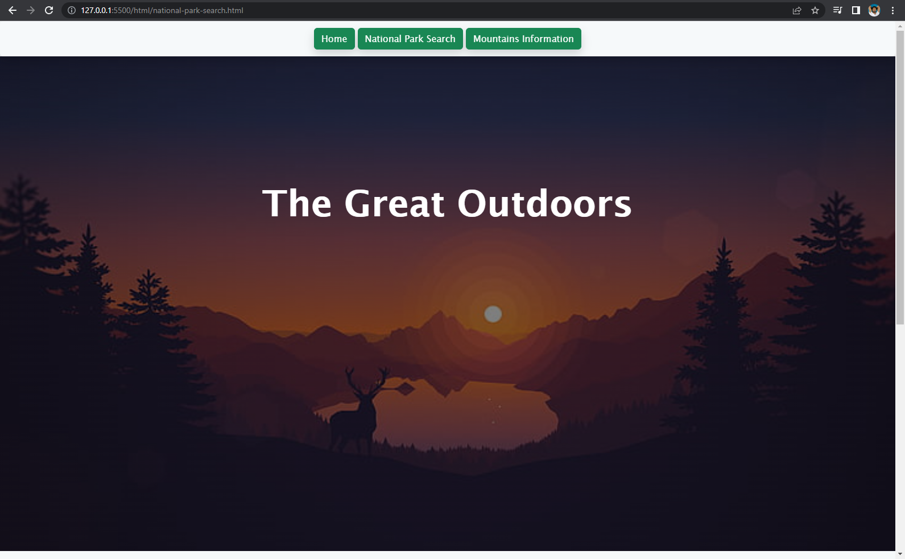
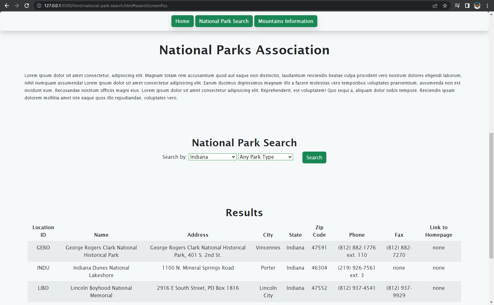
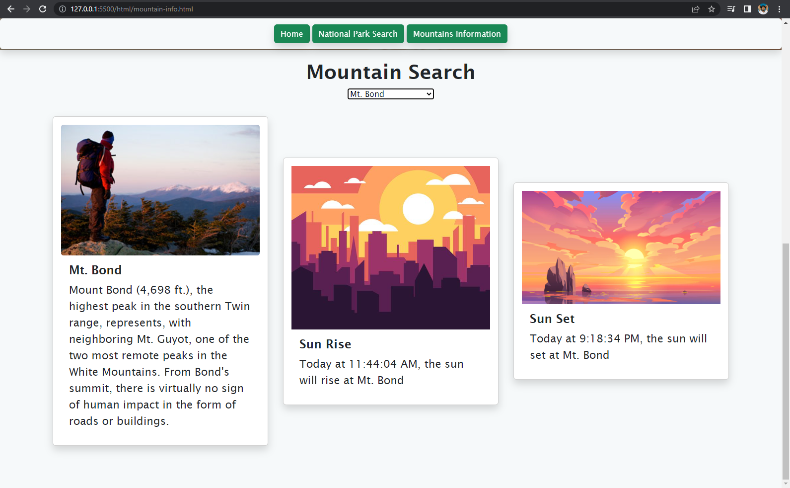

# capstone-project2 #Web Site #WebSite #National Parks #NationalParks #APIusage #API #FirstAttempt #FirstTry
This website contains 3 pages:
1. Index
    Where the viewer is greeted with a graphic image of a mountain and the Phrase, "The Great Outdoors". As the viewer scrolls down, they will see the site navagation bar hovering on the top of the screen, the main page with all of the client's text, and img information. 
    
2. National Park Search
    The viewer is greeted with a graphic image of a deer overlooking a forest, a lake, mountains in the horison, and sunset in the backdrop. As the viewer scrolls down, they will see the site navagation bar hovering on the top of the screen, the main page containing a search engine. The search engine allows the user to search the client's database through for two types of filters: Park type, and state location. After choosing the desired the filter, and pressing the search button, they will see a table of results appear below. The site will scroll down for the user to get a better look. If the user decides to choose a new filter, the table will disappear, until search has been clicked again.
    
3. Mountain information guide
    The viewer is greeted with a graphic image of an overview of a house nestled in the trees, a lake, and a monumental mountain in the horizon. As the viewer scrolls down, they will see the site navagation bar hovering on the top of the screen, the main page containing a search engine. The search engine allows the user to search the client's database through for different mountains. Once selected, three card like objects will appear below. The first will be a written description of the mountain, the name of the mountain, and it's height. The next card will show the user what time the sun has or will be rising today at the chosen mountain's coordinates.The card after that will be a similar card but showing todays sunset at the chosen mountain's coordinates. Choosing a new mountain will simply replace the previous cards with new cards.
    